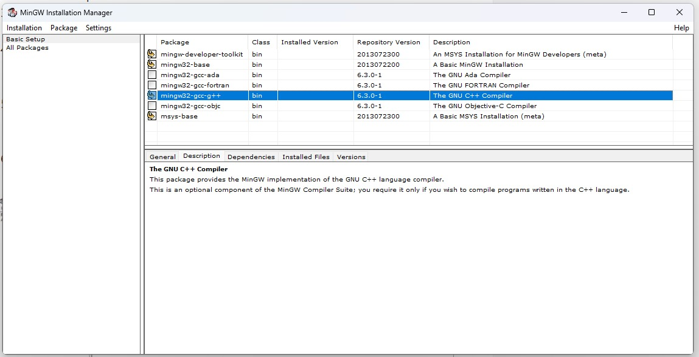
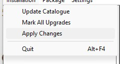
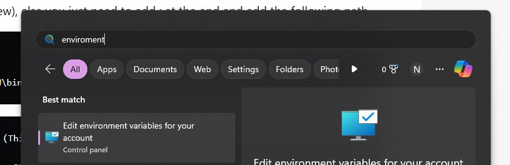
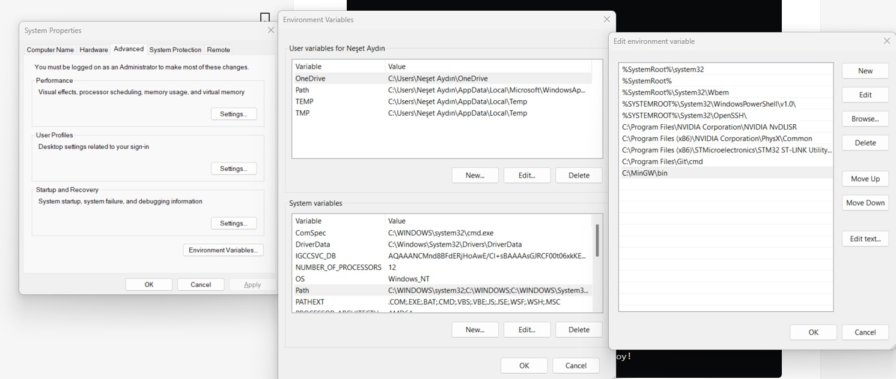
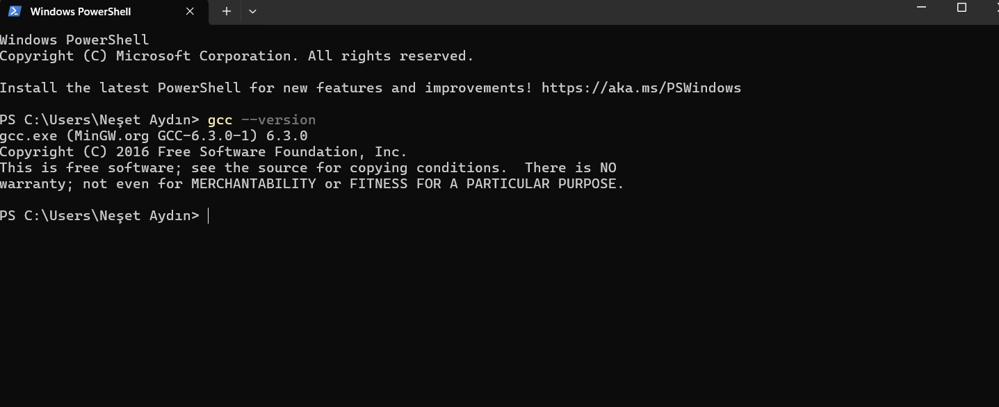
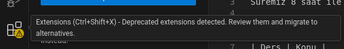
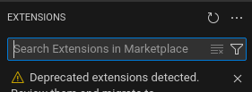

# Geliştirme ortamlarının kurulması

Öncelikle bir geliştirme yaparken bir derleyiciye sahip olmamız yeterli, bu derleyici en temelde yazdığımız kodları bir işlemcinin anlayıp çalıştırabileceği hale getiriyor (Bunu nasıl yaptığını ilk derste konuşacağız ancak ders öncesinde ön bilgi edinmek adına [bu videoyu](https://www.youtube.com/watch?v=Fj90r4l5rds) izlemenizi tavsiye ederim). Biz derleyici olarak `GCC (GNU Compiler Collection)` derleyicisini kullanacağız. Buna ek olarak yazdığımız kodların daha okunaklı gözükmesi için bir kodlama editörüne ihtiyacımız var. Bu eğitimde `vscode` editörünü kullanacağız.  

## Derleyici kurulumu için

### Debian tabanlı linux ortamlarında 

> ```bash
> # Terminali açın ve 
> sudo apt install gcc
> # komutunu çalıştırın ilgili paketlerin kurulumu tamamlandıktan sonra;
> gcc --version
> # komutunu çalıştırın. Çıktı olarak aşağıdakine benzer bir çıktı göreceksiniz. 
> gcc (Ubuntu 11.4.0-1ubuntu1~22.04) 11.4.0
> Copyright (C) 2021 Free Software Foundation, Inc.
> This is free software; see the source for copying conditions.  There is NO
> warranty; not even for MERCHANTABILITY or FITNESS FOR A PARTICULAR PURPOSE.
> ``` 

### Windows ortamında

> Bu [link](https://sourceforge.net/projects/mingw-w64/) üzerinden derleyiciyi indirin. İndirilme tamamlandığında;
>
> 
>
> Paketleri seçin (sizin bu aşamada `mingw32-gcc-g++` seçmeniz yeterli olacaktır.). Akabinde 'installation' butonuna tıkladıktan sonra `apply changes`'e tıklayın;
>
> 
>
> Paketlerin kurulması tamamlandıktan sonra, start/windows butonuna basarak `environment variables` yazın çıkan sonuca tıklayın;
>
> 
>
> Sonra sırasıyla, `environment variables` -> `system variables` -> `Path` -> `New` ve MinGW binary dosyalarının bulunduğu dizini ekleyin.
>
> 
>
> Tüm bu işlemleri doğru tamamladığınızda `powershell`'e `gcc --version` çıktısı buna benzer olmalı.
>
> 

## Editörün kurulumu için

### Debian tabanlı linux ortamlarında 

> ```bash
> # Terminali açın
> sudo snap install code --classic
> # komutunu çalıştırın, eğer snapstore bilgisayarınızda kurulu değilse;
> sudo apt install snap
> ile 'snapstore' u kurup tekrar deneyin.
> ilgili paketlerin kurulumu tamamlandıktan sonra;
> code 
> # komutunu çalıştırın. Editör ekranını göreceksiniz.
> ``` 

### Windows ortamında
> Bu [link](https://code.visualstudio.com/download) üzerinden indirme işlemini yapın ve kurun.

## İlgili uzantıların kurulması

> 1. Extentions sekmesine gelin
>
> 
>
> 2. Arama çubuğuna C/C++ yazın
>
> 
>
> 3. Microsoft'un yayınladığı C/C++ uzantısınmı kurun
>
> 

